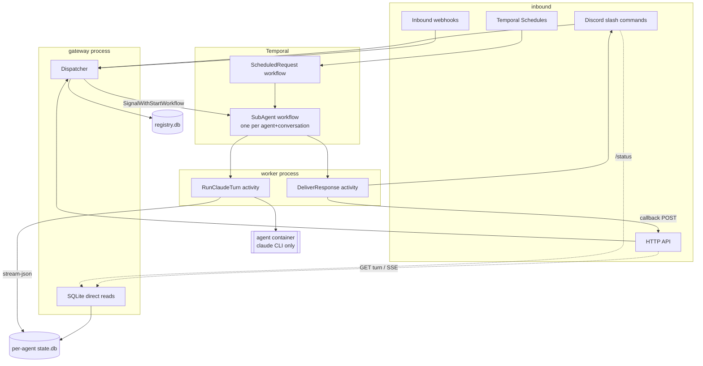

# Architecture

roundclaw is a durable orchestrator for Claude Code. Requests arrive from
Discord or HTTP, are queued by a per-agent Temporal workflow, and are executed
as `claude -p --output-format stream-json` inside a container that holds nothing
but the `claude` binary.

This document describes what the code does today. Layer detail lives in the
files listed under [Layer index](#layer-index).

## System overview



Two paths are deliberately kept apart:

- **Work** goes through Temporal, so it survives a worker crash.
- **Observation and control** (`/status`, `GET /v1/agents/{a}/turns/{t}`, SSE)
  read SQLite directly and never touch Temporal or a model. They keep working
  when an agent is wedged, which is exactly when they are needed.

## Tech stack

| Layer | Choice | Notes |
|-------|--------|-------|
| Language | Go 1.26 | single static binary; `CGO_ENABLED=0` |
| Durability | Temporal Go SDK `go.temporal.io/sdk` v1.46 | workflows, signals, queries, Schedules |
| Temporal server | `temporalio/auto-setup` 1.27 on Postgres 16 | see [infrastructure](infrastructure.md) |
| Storage | `modernc.org/sqlite` v1.54 (pure Go), WAL | one DB per agent + one registry DB |
| Discord | `bwmarrin/discordgo` v0.29 | slash commands, modals, autocomplete |
| HTTP | `net/http` `ServeMux` (Go 1.22 routing) | no framework |
| Config | `gopkg.in/yaml.v3` | secrets referenced by env var name only |
| Agent runtime | `docker` CLI → `@anthropic-ai/claude-code` on `node:22-slim` | no roundclaw code in the image |
| Testing | `stretchr/testify`, `go.temporal.io/sdk/testsuite` | `go test -race` in CI |

## Directory structure

```
cmd/
├── worker/          # Temporal worker: registers workflows + activities, runs retention
└── gateway/         # Discord listener + HTTP server + direct SQLite reads
internal/
├── core/            # Request, Origin, AgentStatus — shared by every layer, imports nothing local
├── config/          # YAML config, env indirection, Discord permission gating
├── registry/        # runtime CRUD: agent definitions + schedules (registry.db)
├── store/           # per-agent SQLite: turns, live_logs, runtime, idempotency
├── claude/          # container argv, stream-json decoder, session ID derivation, router
├── adapter/         # inbound/outbound edges: discord*.go, http*.go, dispatch.go, limits.go
└── temporal/
    ├── contract/    # workflow IDs, signal/query names, activity input types (leaf package)
    ├── workflow/    # SubAgent, ScheduledRequest — deterministic, no I/O
    └── activity/    # RunClaudeTurn, DeliverResponse, workspace resolution
container/           # the agent image (claude CLI) + a scripted fake for tests
Dockerfile           # roundclaw's own binaries
compose.yaml         # Postgres + Temporal + worker + gateway
```

## Layer index

| Document | Covers |
|----------|--------|
| [adapters.md](adapters.md) | Discord commands, HTTP API, webhooks, dispatcher, limits, files |
| [orchestration.md](orchestration.md) | Temporal workflows, activities, signals, contract package |
| [data.md](data.md) | SQLite schemas, migrations, retention, cross-process access |
| [agent-runtime.md](agent-runtime.md) | Container invocation, session derivation, workspaces, isolation |
| [infrastructure.md](infrastructure.md) | Compose topology, images, configuration, CI |

## Module structure

The dependency direction is one-way, from edges inward:

```
cmd/*  →  adapter  →  registry, store, config, core, temporal/contract
          activity →  registry, store, config, claude, core, temporal/contract
          workflow →  core, temporal/contract          (nothing else)
          claude   →  core
          core     →  stdlib only
```

`temporal/contract` exists to break a cycle: an activity needs to signal the
agent workflow, and the workflow references the activity's methods. Both depend
on the leaf instead of on each other.

## Import rules

- `core/` imports no other roundclaw package. Everything may import it.
- `temporal/workflow/` may import only `core` and `temporal/contract`. It must
  not import `store`, `registry`, `config`, or anything else that does I/O —
  workflow code is replayed and must stay deterministic.
- `temporal/activity/` may import anything except `temporal/workflow`.
- `adapter/` may import `registry`, `store`, `config`, `core`, `contract`. It
  must not import `temporal/activity` or `temporal/workflow`; it reaches the
  workflow through the Temporal client and the names in `contract`.
- `store/` and `registry/` must not import `adapter` or `temporal/*`.
- `claude/` must not import `store`, `registry`, or `adapter`. It builds argv
  and parses output; it does not know where either comes from.

## Key patterns

- **Deterministic session identity.** The Claude session ID is derived from the
  workflow ID via UUIDv5 (`claude.SessionID`), never captured from output. A
  retried activity reattaches to the same session with no state to look up.
  See [agent-runtime.md](agent-runtime.md).
- **Origin as a discriminated union.** `core.Origin` carries where a reply must
  go (`discord` / `http_poll` / `http_callback`). It is written to
  `turns.origin` and read back by `DeliverResponse`. A new event source is one
  constant plus one switch case.
- **Read path bypasses the core.** Status and results are served by reading the
  agent's SQLite file directly, in the gateway process. WAL makes this safe
  while the worker writes.
- **Signal-with-start.** Every submission is a `SignalWithStartWorkflow`, so
  there is no "is the workflow running?" check and no start/signal race.
- **Idempotency at admission.** `turns` rows are inserted by the gateway before
  signalling, inside the same transaction that claims the `Idempotency-Key`.
  A client retry returns the original `turn_id` and starts no second turn.
- **Append-only migrations.** `CREATE TABLE IF NOT EXISTS` is invisible to an
  existing database, so every added column is also an `ALTER TABLE` in a
  `migrations` slice whose duplicate-column error is ignored.

## Constraints

- **Heartbeats are mandatory.** A Temporal activity learns about cancellation
  only through a heartbeat response. `RunClaudeTurn` heartbeats every second and
  the worker sets `MaxHeartbeatThrottleInterval: 1s`; without both, `/stop` and
  `/steer` are delayed by tens of seconds.
- **Every turn runs with cwd `/workspace`.** `claude --resume` scopes its
  session lookup to the working directory, so a turn started elsewhere silently
  fails to find its session.
- **`/home/node/.claude` must be a per-agent host mount.** Containers are
  `--rm`; transcripts live there and `--resume` has nothing to resume without it.
- **The prompt is passed immediately after `-p`.** `--allowedTools` is variadic
  and swallows a trailing positional argument.
- **One Temporal namespace per environment.** Workflow IDs encode agent and
  conversation but not environment, so two deployments sharing a namespace
  deliver each other's signals.
- **No secrets in config.** `roundclaw.yaml` names environment variables
  (`token_env`, `api_key_env`, `oauth_token_env`, `webhook_secret_env`); values
  come from the process environment.
- **Callback URLs must resolve to public addresses.** Checked at admission and
  again at delivery (`core.AssertPublicCallbackHost`); redirects are not
  followed.
