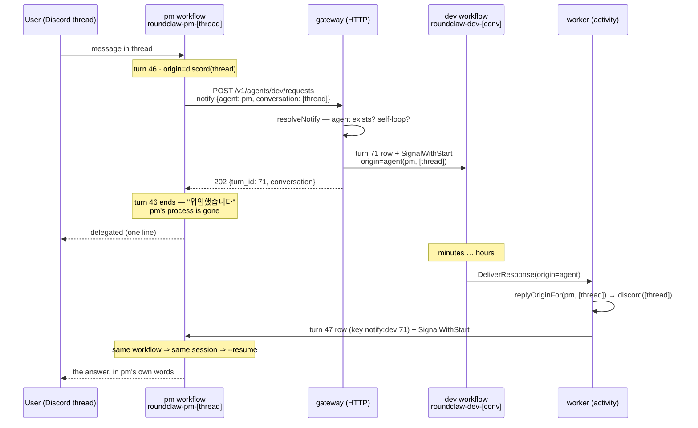
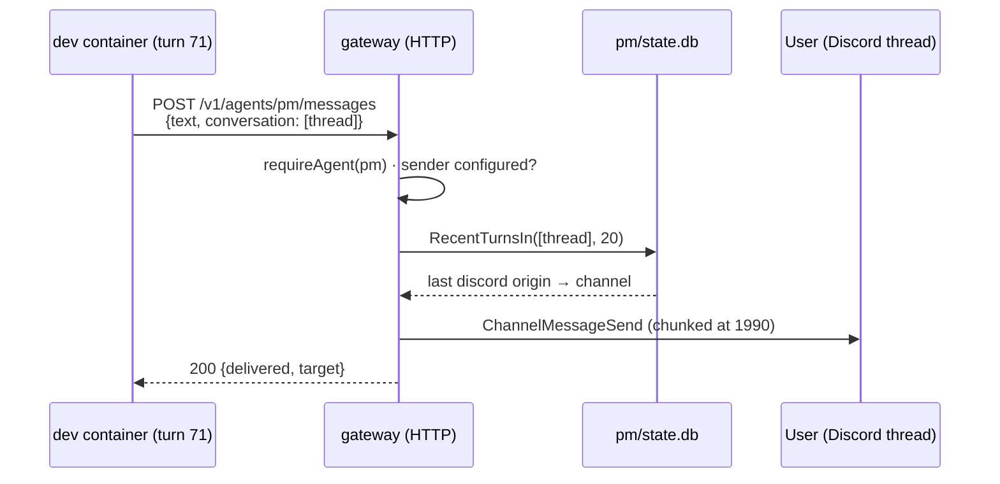

# Delegation flows: `notify` and `say`

How a delegated result gets back, and how an agent speaks while it is still
working. Two mechanisms, deliberately different in guarantee:

| | `notify` (`send --notify-me`) | `say` (`say --to`) |
|---|---|---|
| Decided by | the **delegator**, before the work starts | the **worker**, in the moment |
| Carried as | `core.OriginAgent` on the delegated turn's row | nothing — a one-shot HTTP call |
| Produces | a **new turn** for the delegator | one Discord message |
| Runs when | the delegated turn finishes, automatically | the moment it is called |
| Survives a crash | yes — the address is in SQLite | no — nothing retries or records it |
| Costs | one extra turn | nothing |
| For | final results and failures | progress, findings, "still working" |

The split exists because the two failure modes are opposite. `notify` cannot be
forgotten by a model — the framework acts on a row, not on the agent's
cooperation — but it costs a turn. `say` is free and flexible but happens only if
the agent remembers to call it. **A final result must never travel by `say`**: an
agent that ends its turn having said nothing still reports, and that is the whole
point.

---

## Why this exists

Before it, a turn could speak exactly once — at its own end, to wherever its
request came from. A delegating agent therefore had no way to keep "I'll tell you
when it's done": its own turn ended first, and the delegated result was recorded
with nobody left to read it.

Waiting instead (`send` with its default `--wait`) only moves the failure. It ties
the result to a live process, so a shell timeout — or the delegator's own turn
ending — kills the reader while the delegated turn runs on to completion. The
result exists, correct and complete, in the worker's SQLite file, and no path
delivers it.

---

## `notify` — the return address

### The flow



### What is written where

| Step | Record |
|---|---|
| pm's turn | `pm/state.db` turn 46, `origin=discord(thread)`, `conversation=<thread>` |
| the delegation | `dev/state.db` turn 71, **`origin=agent(pm,<thread>)`** — the return address, durable |
| the return trip | `pm/state.db` turn 47, `origin=discord(thread)`, `conversation=<thread>`, idempotency key `notify:dev:71` |
| pm's answer | delivered to the thread by the ordinary `discord` case |

Nothing is held in memory across the gap. The delegating process, its HTTP
connection, the gateway and the worker can all die between the delegation and the
result; the address on dev's turn row is what makes the return trip happen anyway.

### Design points

**It queues a turn rather than posting the result.** The delegator knows what the
human asked; a raw dump of another agent's output is not an answer. pm wakes in
the *same conversation*, therefore the same Claude session, so it still remembers
why it delegated.

**One activity, one idempotency key.** The row write and the `SignalWithStart`
live together in `deliverToAgent` under `notify:<agent>:<turn>`. `DeliverResponse`
is retried (5 attempts), and without the key a retry would wake the delegator a
second time with the same result. Splitting the two would also allow a
"row written, signal lost" state.

**The reply address is derived, not carried.** `replyOriginFor` reads the last
human-facing turn of the delegator's conversation, looking back up to 20 turns so
a run of notifications does not hide it. A conversation has exactly one audience,
so that turn is authoritative — and a second copy of the address on the delegated
turn could go stale.

**Failures take the same path.** An errored or stopped turn notifies too, labelled
as such. Reporting only successes is how a dead delegated turn becomes silence
again.

**The handle points at the worker's conversation.** The prompt pm receives names
`dev`'s conversation, not its own, so a follow-up resumes the session that did the
work:

```
[위임 완료] 에이전트 dev · turn 71 · $0.0181
이어서 시키려면: roundclaw send dev --conversation notify-probe "..."

결과:
chain-ok
---
이 결과를 요청한 사람에게 당신의 말로 보고하세요.
```

### What is refused, and why

| Refused | Reason |
|---|---|
| `notify.agent` naming the target agent **in the conversation it is running in** | the turn's result would queue a successor of itself, forever, each iteration paying for a container |
| an unknown or disabled `notify.agent` | a typo should cost a 400, not a turn that runs and then has nowhere to report |
| `notify` together with `callback_url` | two different return addresses; the caller must pick one |

Delegating to *yourself in a different conversation* is allowed — that is a
background job, not a loop, and the ordinary queue bounds it.

### Not yet bounded

`A → B → A` is the reporting path and must stay allowed, so nothing rejects a
cycle by membership. What is missing is a hop count and a spend budget: a
ping-pong between two agents is currently limited only by the tool instructions
telling agents not to form one. A propagated envelope (`root`, `depth`, `budget`,
`deadline`) checked at `Dispatcher.submit` is the intended fix.

`notify.agent` is also **claimed, not proved.** Delegate tokens are shared, so the
gateway believes the caller's own identity; it checks that the named agent exists
and refuses the self-loop, and a wrong claim costs one wasted turn elsewhere.
Per-agent tokens would let the server fill the field in instead of believing it.

---

## `say` — speaking mid-turn

### The flow



No turn, no session, no container, no model call, nothing scheduled. It is one
REST call from inside the agent's own container to the gateway that is already
running.

### Resolving the target

The CLI fills both fields from the environment the worker injects, so the common
cases need no flags:

| Command | Speaks as | In which conversation | Source |
|---|---|---|---|
| `say "..."` | me | the one I am running in | `ROUNDCLAW_AGENT_ID` + `ROUNDCLAW_CONVERSATION_ID` |
| `say "..." --to pm` *(pm delegated to me)* | pm | the conversation pm is waiting in | matches `ROUNDCLAW_REPLY_TO` → `ROUNDCLAW_REPLY_TO_CONVERSATION` |
| `say "..." --to director` *(no delegation)* | director | its **default** conversation | no conversation sent; the server resolves the default |
| `say "..." --conversation X` | as given | X | flags, verbatim |

`--to` is a `say` flag only. `send`'s target is its positional agent, and its
`--conversation` says where on that agent's side to run.

### The authorisation model

The request names an **agent and a conversation — never a channel.** The channel
is resolved server-side from that conversation's own history
(`conversationChannel`), so:

- there is no field in which to name an arbitrary channel;
- a conversation with no Discord audience (API-driven, or notifications only) is
  refused with a 400 — its caller reads results rather than being told them;
- an agent can reach **any conversation that already has an audience**, including
  another agent's. The boundary is "already exists and already has an audience",
  not "mine only".

That last point is deliberate — it is what lets a worker report into the thread
that is waiting — and it is why `say` is on the delegate-scoped surface at all: it
starts no work, spends no tokens, and cannot invent a destination. What bounds
abuse is a rate limit, not a hop count; `say` consumes no envelope because it
creates no turn.

> **Known leak, unrelated to `say` itself:** `GET /v1/agents` returns full agent
> definitions to delegate-scoped tokens — `work_dir`, `deny_paths`, `image`,
> `group_add`, `tools`, `discord_channels` — although `delegateAllowed` blocks
> `…/definition` for exactly that reason. Reconnaissance value only (a channel ID
> does not by itself make a conversation reachable), but the listing should be
> trimmed to `{id, description, enabled}` for restricted tokens.

---

## Choosing between them

```
작업이 오래 걸린다  ──▶ send --notify-me   (+ 중간에 say 로 한 줄)
작업이 짧다        ──▶ send              (동기 대기, 지금 턴에서 답)
할 말만 있다       ──▶ say
```

Never end a turn having promised a follow-up without one of the first two: once
the turn ends the process is gone, and nothing will report.

---

## Where the code is

| Piece | Location |
|---|---|
| `OriginAgent` type, `AgentOrigin`, validation | `internal/core/origin.go` |
| Return-trip delivery, reply-address lookup, prompt | `internal/temporal/activity/deliver.go` (`deliverToAgent`, `replyOriginFor`, `notifyPrompt`) |
| Admission checks for `notify` | `internal/adapter/http.go` (`resolveNotify`) |
| Speaking endpoint and target resolution | `internal/adapter/http_messages.go` |
| Identity injected into the container | `internal/temporal/activity/run_turn.go` (`identityEnv`) |
| CLI flags and env defaults | `cmd/roundclaw/main.go` (`cmdSend`, `cmdSay`) |
| Delegate-scope whitelist | `internal/adapter/http.go` (`delegateAllowed`) |

See also: [orchestration.md](orchestration.md#deliverresponse) for the delivery
switch, [data.md](data.md#registrydb) for `turns.origin`, and
[usage.md](../usage.md#agents-working-together--delegation) for the operator's
view.
