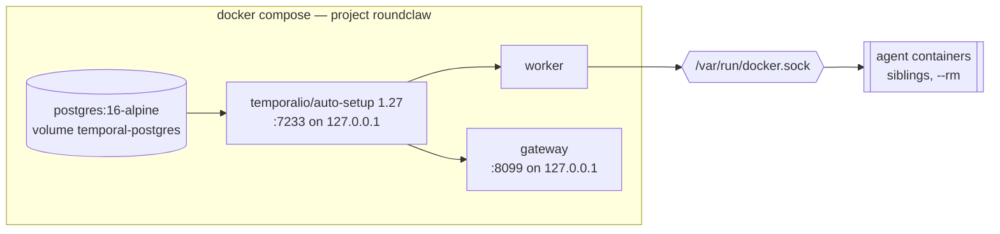

# Infrastructure

## Topology

Four services. Both roundclaw services wait on Temporal's healthcheck, and
Temporal waits on Postgres's.

- **postgres** — Temporal's persistence. The named volume is the only state
  outside the repository directory.
- **temporal** — `auto-setup` creates the schema and default namespace on first
  boot. Port 7233 is published to loopback only, so the `temporal` CLI still
  works from the host.
- **worker** — runs the Temporal worker, registers `SubAgent`,
  `ScheduledRequest` and the activity struct, and runs the retention loop.
- **gateway** — Discord session plus HTTP server; also the process that reads
  SQLite directly to answer status queries.

## Two decisions worth knowing

**`ROUNDCLAW_ROOT` is mounted at the same absolute path inside the containers.**
The worker asks the host's Docker daemon to start agent containers, so every
`-v` path it constructs is resolved by the *host*, not by the worker's own
filesystem. If the repository lived at a different path inside the container,
every agent mount would point somewhere that does not exist. Compose therefore
requires the variable (`:?`) rather than defaulting it.

**Agent containers are siblings, not children.** The worker mounts
`/var/run/docker.sock` read-write and gains its group through `group_add`, so
it never runs as root. Containers it starts are peers of itself under the host
daemon.

Both roundclaw services run as `${ROUNDCLAW_UID}:${ROUNDCLAW_GID}` so the
workspace stays writable by the containers and by whoever is debugging them.

## Images

| Image | Contents | Built from |
|-------|----------|-----------|
| roundclaw | `worker` + `gateway` + `roundclaw` CLI on `alpine:3.20`, plus `docker-cli` | `Dockerfile` |
| agent | `@anthropic-ai/claude-code` on `node:22-slim` + git, ripgrep | `container/Dockerfile` |
| fake agent | a scripted `claude` stand-in for tests | `container/fake/Dockerfile` |

The roundclaw image builds with `CGO_ENABLED=0` — the SQLite driver is pure Go,
so the binaries run on a base with no libc to match. It carries `docker-cli`
because the worker shells out to start each turn.

**Networks.** The compose services share the project's default bridge. Agent
containers, though, are siblings the worker starts through the host daemon and
attaches to `container.network` (an extra user-defined bridge, e.g. `ingress`),
so by default they cannot see the gateway. Two features need them to: reaching a
local service like Outline (`http://outline:3000`), and agent-to-agent delegation
(an agent calling the gateway's own API). The gateway therefore also joins that
network, with a stable alias (`roundclaw-gateway`) an agent's `team` tool points
`ROUNDCLAW_URL` at. It keeps `default` too, or it would lose Temporal and
Postgres.

## Configuration

`roundclaw.yaml` (see `roundclaw.example.yaml`), plus `.env` read by compose.

| Section | Keys |
|---------|------|
| `workspace_root` | one directory per agent; relative paths resolve against the config file, not the process CWD, so worker and gateway agree wherever they start from |
| `temporal` | `host_port`, `namespace`, `task_queue` |
| `container` | `runtime`, `image`, `api_key_env`, `oauth_token_env`, `secrets_key_env`, `turn_timeout`, `stop_grace` |
| `discord` | `token_env`, `guild_id`, `command_permission`, `allowed_roles`, `allowed_users` |
| `http` | `addr`, `tokens_env`, `delegate_tokens_env`, `wait_timeout`, `max_sse_per_agent`, `callback_secret_env`, `webhook_secret_env` |
| `limits` | `turns_per_hour`, `cost_per_day_usd`, `global_cost_per_day_usd`, `max_concurrent_turns` |
| `retention` | `transcript_days`, `turn_days`, `interval` |
| `router` | `enabled`, `model`, `timeout`, `channels` (v2 routing; not on by default) |

**Every secret is referenced by the name of the environment variable holding
it.** No value is ever stored in the config file.

Agent definitions live in `registry.db`, not in the YAML — they are created and
edited at runtime from Discord or the HTTP API.

## CI

`.github/workflows/ci.yml`, two jobs, with in-progress runs cancelled on a new
push.

**test** — `gofmt -l` (checked, not applied: CI rewriting the tree hides the
habit that caused the diff), `go vet`, `go build`, `go test -race -count=1`, and
a `go mod tidy` diff check. `-race` earns its cost here: the activity streams
container output on one goroutine while heartbeating from another, and the
adapters serve concurrent HTTP requests against shared SQLite handles.

**images** — builds both agent images and then runs the fake with
`--allowedTools` *after* the prompt, asserting it still honours the real CLI's
argument order. Without that check the fake could drift into accepting an argv
the real `claude` rejects, and every test using it would quietly test nothing.

## Operational notes

- **One Temporal namespace per environment.** Workflow IDs encode the agent and
  conversation but nothing about the environment, so two deployments sharing a
  namespace deliver each other's signals — including to workflows whose task
  queue no longer has a worker.
- **Restart before deleting a workspace.** A process holding an open SQLite
  handle keeps serving the deleted inode; see [data.md](data.md).
