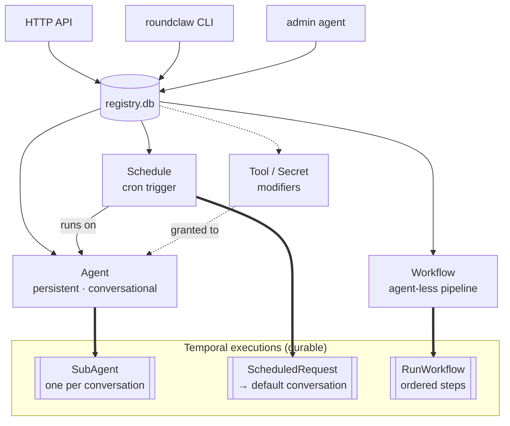

# Orchestration

Temporal is what makes an interrupted turn resumable rather than lost. It owns
two things and only two: the request queue, and the durability of the work.
Everything a user can *observe* is served from SQLite instead
([data.md](data.md)).

## What you register: agents, schedules, workflows

Three kinds of work live in the runtime registry ([registry.db](data.md#registrydb))
and can be created, changed, and removed *while roundclaw runs* — no restart, no
YAML edit. Each maps to a different Temporal execution described below.



| | **Agent** | **Schedule** | **Workflow** |
|---|---|---|---|
| What it is | a persistent, conversational bot | a cron trigger on an agent | an agent-less pipeline of prompts |
| Runs as | `SubAgent`, one per conversation | `ScheduledRequest` → the agent's default conversation | `RunWorkflow`, ordered steps |
| Session / memory | yes — resumes its Claude session | uses its agent's session | none — each step is one-shot, chained by passing outputs forward |
| Triggered by | a Discord message or an API request | a cron on a Temporal Schedule | started by hand (or, later, a schedule) |
| Channel | bound to one (one channel → one agent) | reports into a channel | reports the final result into a channel |
| Registry table | `agents` (+ `agent_channels`) | `schedules` | `workflows` |

How they relate:

- **A schedule always runs on an agent** — it is a recurring prompt fired into
  that agent's *default* conversation, not a standalone thing. There is no
  agent-less schedule; a standalone or multi-step recurring job is a **workflow**
  instead (and a workflow can, in turn, be put on a schedule).
- **A workflow is deliberately agent-less** — no session, queue, or channel
  binding, because a scheduled or one-off pipeline needs none of what an agent
  carries. Its steps each run as their own activity, so a crash resumes at the
  step it was on rather than from the top.
- **Tools and secrets are modifiers, not work.** A registered tool
  ([agent-runtime.md](agent-runtime.md#registered-tools)) or secret is *granted*
  to an agent to widen what a turn can do; neither runs on its own.

All three are registered the same three ways, because they are all just registry
rows — nothing needs a redeploy to appear:

- **HTTP API** — `POST/PUT /v1/agents`, `/v1/schedules/{id}`, `/v1/workflows`
  ([adapters.md](adapters.md#http-httpgo)).
- **CLI** — `roundclaw`, a thin client over those routes
  ([usage.md](../usage.md#command-line-roundclaw)).
- **The admin agent** — describe the change in plain language and it drives the
  same API itself ([adapters.md](adapters.md#admin-is-an-agent)).

The YAML `agents:` list is a one-time bootstrap only: it seeds an empty registry
at first start and is ignored afterwards ([data.md](data.md#registrydb)). The
three Temporal executions these map to are next.

## Workflows

### `SubAgent` — one per conversation

> **The name is about orchestration, not Claude.** A `SubAgent` workflow is
> roundclaw's durable executor for one conversation. It is unrelated to Claude's
> *native* subagents (`--agent NAME`), which are a CLI feature the workflow knows
> nothing about — see [agent-runtime.md](agent-runtime.md#native-subagents). One
> is a Temporal execution that owns a queue; the other is a persona the `claude`
> process runs under. They can coexist without ever touching.

`internal/temporal/workflow/subagent.go`. Long-lived, one execution per
`contract.WorkflowID(agentID, conversationID)`:

```
roundclaw-<agentID>-default          default conversation
roundclaw-<agentID>-<conversationID> a Discord thread
```

A conversation — not an agent — is the unit that owns a Claude session, a queue
and a workspace. Every ID has the same three-part shape; the default
conversation uses the `default` sentinel (`contract.DefaultConversation`) rather
than a second format. The sentinel cannot collide with a thread, whose ID is an
all-digit Discord snowflake.

State held in the workflow:

| Field | Purpose |
|-------|---------|
| `queue []core.Request` | pending requests, in order |
| `turnCount` | cumulative, reported by the status query |
| `currentTurnID` | the turn being executed |
| `lifecycle` | idle / running / stopping |
| `sessionReady` | some turn actually opened the Claude session |
| `sessionLost` | a recap is owed to the next turn |

The queue is a slice, not a "messages arrived" flag. Three requests during one
long turn produce three turns and three replies — that regression is the reason
roundclaw exists.

**Signals**

| Signal | Effect |
|--------|--------|
| `enqueue` | append to the queue |
| `steer` | cancel the running activity, put the instruction at the head of the queue, start immediately — same session, so context survives |
| `stop` | cancel the running activity and drop the queue |

**Query**

`status` returns lifecycle, queue depth and turn count — the things the
workflow genuinely owns, held in memory, so answering breaks no determinism
rule. It never reads SQLite: a query handler runs in workflow context and cannot
do I/O.

**Continue-As-New** fires at `maxTurnsPerRun = 100` or when
`GetContinueAsNewSuggested()` is true. The queue, turn count, `sessionReady`
and `sessionLost` all cross the boundary — dropping any of them would either
lose a request or make the next turn try to create a session that already
exists.

**Cancellation cleanup** runs in a `workflow.NewDisconnectedContext`; a
cancelled context cannot start the activity that closes out the turn row.
`abandonQueue` marks dropped turns so they do not sit at `running` forever,
misreporting the agent as busy long after the turn is gone.

### `ScheduledRequest`

Started by a Temporal Schedule; carries only a schedule ID. The definition is
read at fire time, so editing a schedule takes effect on the next run with
nothing to recreate in Temporal. It always targets the agent's **default**
conversation: a daily report that opened a new conversation each morning could
never build on what it said yesterday.

### `RunWorkflow` — the agent-less pipeline

`internal/temporal/workflow/runworkflow.go`. A workflow is not an agent: no
session, no queue, no channel binding. It is a definition of ordered *steps* —
each a prompt with its own settings — that Temporal runs as a pipeline, feeding
each step's output to the next and delivering the final result to a channel.

- `LoadWorkflow` reads the definition at run time (an edit takes effect on the
  next run), then the workflow loops the steps, running each through
  `RunWorkflowStep` and accumulating a context string of prior outputs.
- **Each step is its own activity**, so a worker crash resumes the pipeline at
  the step it was on rather than from the top — the whole reason to model a
  pipeline in Temporal rather than one long turn.
- Started manually (`Dispatcher.RunWorkflow` → `ExecuteWorkflow`, one execution
  per run so runs never collide) or, later, by a schedule. It is agent-less
  precisely because a scheduled or one-off job needs none of what an agent
  carries; forcing one on it was ceremony.

## Activities

`internal/temporal/activity`. Registered as one struct via
`NewActivities(cfg, stores, reg, discord, tc)` — dependencies are injected
through the constructor because `RegisterActivity` on a struct registers *every*
exported method, and a stray `SetDiscord` setter panics worker startup.

**Failing fast is explicit.** `newNonRetryable` wraps the errors no retry can
fix — a deleted agent, a missing credential, an origin this binary does not
implement — as a `temporal.ApplicationError` with `NonRetryable` set. It must be
an ApplicationError rather than a marked ordinary error: Temporal matches
`RetryPolicy.NonRetryableErrorTypes` against the failure's *type*, and an
ordinary error's type is its Go type name (`wrapErrors` for anything built by
`fmt.Errorf`), so a sentinel in the message never matches. The flag is honoured
directly, which also covers callers whose policy names no types — `deliver()`
does not.

### `RunClaudeTurn`

1. Resolve the agent definition and the conversation's workspace
   ([agent-runtime.md](agent-runtime.md)).
2. Build argv and `docker run` the agent container.
3. Decode stream-json line by line into `live_logs`.
4. **Heartbeat every second.**
5. On cancellation: `SIGINT`, wait `container.stop_grace`, then `SIGKILL`.
6. Write the result, cost and status to the `turns` row.

Heartbeating is not optional. An activity only learns it was cancelled through
the response to a heartbeat, so `/stop` and `/steer` are exactly as responsive
as the heartbeat interval — and the SDK throttles outbound heartbeats to ~80% of
`HeartbeatTimeout`, which is why the worker also sets
`MaxHeartbeatThrottleInterval: 1s` alongside `HeartbeatTimeout: 10s`.

**Session-loss recovery.** Transcripts are cleaned up after
`cleanupPeriodDays`, and a volume can be lost. When the session is gone, the
activity builds a recap from the last N turns of the *same conversation*
(`store.RecentTurnsIn`) and starts a fresh session with it. This is the only
place the turn window is fed back into a prompt — the live session already holds
the context, so replaying it every turn would just be duplication.

### `LoadWorkflow`, `RunWorkflowStep`

Housekeeping for `RunWorkflow`. `RunWorkflowStep` reuses the same container
execution as `RunClaudeTurn` — streaming, heartbeat, graceful stop — but its
config comes from the step, not an agent, and there is no session to resume:
each step is a one-shot run that receives the earlier steps' outputs as input.
The workflow's own `state.db` (under `workspace/workflows/<id>/`) records each
step as a turn, so a run is inspectable. Steps run under `bypassPermissions` by
default — a pipeline has no human to answer a permission prompt — and get the
**global** secrets injected, since a workflow has no agent scope of its own.

### `DeliverResponse`

Switches on `turns.origin`:

- `discord` — send to the channel, chunked at 2000 characters.
- `http_callback` — signed POST, retried by Temporal's retry policy, host
  re-validated before the request.
- `http_poll` — nothing to do; the row is already the answer.
- `agent` — queue the result as a new request for the agent that delegated the
  work, in its conversation, so it reports to the human in its own words. This is
  the only case that *creates* work rather than just delivering it, and the only
  one that crosses a workflow boundary: it writes the turn row and calls
  `SignalWithStartWorkflow` in the same activity, under one idempotency key
  (`notify:<agent>:<turn>`), because this activity is retried and a second signal
  would wake the delegator twice for one result. The delegator's own reply address
  is read from the last human-facing turn of that conversation rather than carried
  along, since a conversation has exactly one audience.

The `agent` case is drawn end to end in [delegation.md](delegation.md), with what
is written where at each step.

That last case is what makes "I'll tell you when it's done" keepable: the return
address is on the delegated turn's row, so the result comes back even after the
delegating process, its connection and the worker have all died. Nothing in the
agent's own behaviour is required — an agent that simply ends its turn still
reports.

### `AbandonTurns`, `RemoveConversationWorkspace`

Housekeeping the workflow triggers explicitly: close out turn rows dropped by
`/stop`, and tear down a conversation's worktree when it is finished (never
automatically — a quiet thread usually still has uncommitted work in it).

## The `contract` package

`internal/temporal/contract` is a leaf holding what both sides must agree on:
workflow IDs, signal and query names, workflow type names as strings, and
activity input types. Without it, `activity` → `workflow` (to signal the agent)
and `workflow` → `activity` (to execute it) would be an import cycle.

Renaming anything in it breaks in-flight workflows, which is precisely why it
lives in a package neither side owns.
